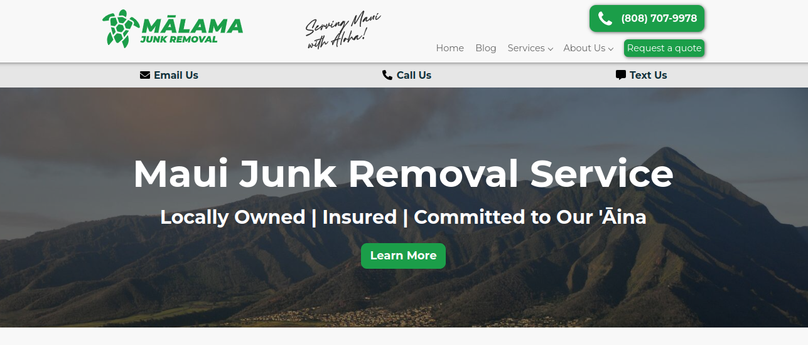

    

### Project overview

The Foodie Finders web app allows UH Manoa students to find restaurants and vendors on their campus. Vendors are able to post their own pages on the website to advertise their own products. On this site, students are encouraged to leave reviews and feedback on vendors that they have eaten from. Students have a variety of ways to view all of the different vendors that serve food. They are able to search for vendors by rating, by hours open, or by popularity. Students also have the ability to see a featured restaurant, which is curated by moderators of the Foodie Finders website. 

Vendors and reviewers must make accounts before leaving any content on the website. When vendors add a restaurant to the website, they leave information about the location, description, and a picture to be displayed for their vendor page. Vendors have the ability to delete and modify their restaurants that they have created.

When normal students make accounts to leave reviews, they are also able to add reviews to any restaurant. Each student is limited to 1 review per restauarant. They can remove their review from any restaurant if they also wish to do so. Their rating for the restaurant is used to calculate an average review rating for the restaurant. This is used for ranking the different restaurants by rating and popularity.

### Role

For this project, four other group members help develop this project. All group members worked on different aspects of the website such as restaurant pages, reviews, user pages, etc.

I played different roles in terms of the content that I developed for the website, My biggest responsibility for this project was the review functionality. This included the functionality for adding reviews, deleting reviews, review calculation, the display for all of the stars on each vendor page, and the system for the ratings in the backend.

On top of the ratings, I had generally supported the project by helping with debugging, developing test cases, and implementing other smaller features. One notable feature is the image picker functionality for the add vendors and for the user page.

    

### Learning Outcomes
This project was the culmination of all concepts ever covered in ICS 314. From this project, I learned a lot about project planning, version control, and teamwork skills. This project was the first time I had ever collaborated with others on code, which is a massively critical skill for a career in software engineering.

On top of all of the communication and collaboration skills I learned from the project, this project reinforced my web development skills I learned from previous modules in ICS 314. This includes user interface design, APIs, and software frameworks. This project heavily relies on Meteor, an application framework that has many great out of the box features for developers. I hope to expand to other frameworks and technologies not covered in this class, but I think that this project was a vital stepping stone for seeing what software engineering has to offer.

Take a look at our project Github Repository: [https://github.com/FoodieFinders/Foodie-Finders](https://github.com/FoodieFinders/Foodie-Finders)

Check out the live website here: [https://foodiefinders.lol](https://foodiefinders.lol)
