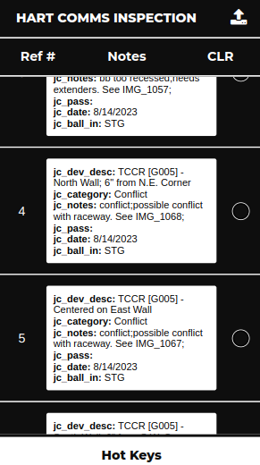

    

### About 
The HART Comms App is an app developed by me that serves the purpose of aiding Core Systems engineers with doing inspections of communications equipment for the Honolulu Rail Transit Project. The app would streamline the process for communications equipment inspections, allowing for quick "hotkey actions" and quick note-taking. This project was developed solely by me, using React Native and Expo Go. This project was a very open ended one, with the intern mentor giving much leniency in the specifications. While this app is not at all important to the overall rail project, the app could make in impact on the the general workflow for county side inspectors at HART.

### Role
This project was tasked solely to me by an engineer that wanted a more streamlined way to do Comms equipment inspection. I developed the design and functionality of the app, which included making mockups in Figma and programming the app itself. Throughout the project, I did have plenty of support along the way from my mentor, though he tried to make the specifications as open ended as possible, letting me have complete control over the entire project from start to finish.

### Learning Outcomes
From this project, I was able to gain a lot of experience with Javascript and React Native. For this project, I did also have to have a good understanding of how field inspections worked, which was quite valuable for understanding the construction field at large. I gained familiarity with the React Native platform Expo Go, which I particularly enjoy for its ease of setup. 

Another huge thing that I learned from this project is to not underestimate the power of planning, since I actually jumped the gun on many fundamental aspects of this project. I'm still currently improving this app, and many much needed optimizations are needed for it to be completely functional for the field as of now.
