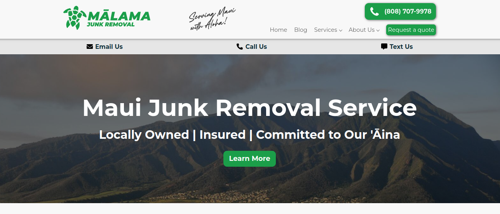

    

### About

The Malama Junk Removal website is a website designed for a local junk removal business based on Maui, Hawaii. This website serves as an advertisement for the business, providing a professional appearance, and an opportunity to reach potential clients through blog posts such as ["How to Recycle Construction & Demolition Waste on Maui"](https://malamajunkremoval.com/how-to-recycle-construction-demolition-waste-on-maui). This website runs on the WordPress platform as a custom theme, able to be easily modified by the client. On top of providing a website, I was able to provide plenty of insight on establishing a web presence and also contributed heavily to online marketing strategies for the company.

### Role
For the entirety of the project, I was the sole designer and developer. However, certain UI elements were made by the owner, such as the logo and colorscheme. Outside of that, I made most design and functionality choices. For the creation of the custom theme and implementation onto WordPress, I was the sole developer. Because I was the sole developer, I had the complete freedom to choose a web platform for this emerging company. Due to its ubiquity, especially in the Maui local business scene, I ended up with WordPress being my web content management system.

### Learning Outcomes
From this project, I gained a lot of knowledge on WordPress. Before this, I actually had no prior experience with a content management system, and only had some experience in vanilla html/css. On top of learning the tech, I was also able to gain insight on starting up a local business. In between developing the code for the website, I did plenty of research on establishing a good web presence, enabling me to contribute to marketing strategies employed by the company.

Check out the website here: [https://malamajunkremoval.com](https://malamajunkremoval.com)
